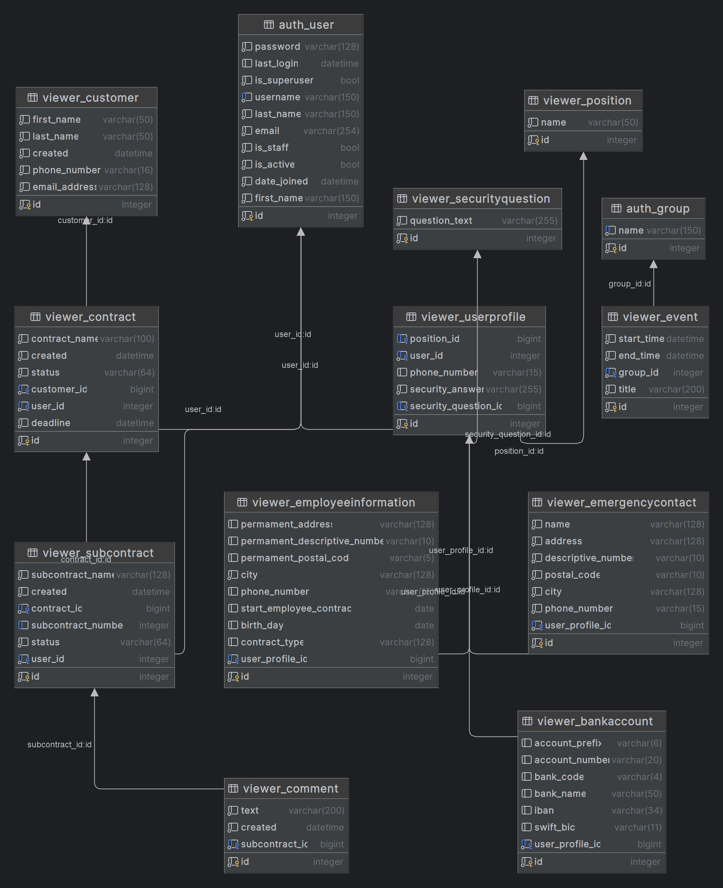

# Employee Hub 
### Final project SDAcademy
Online aplikace pro správu firemních dat jako komplexní nástroj, který usnadňuje organizaci a sledování všech důležitých informací v rámci společnosti. 
Umožňuje efektivní správu objednávek, což zajišťuje rychlé a přesné zpracování požadavků zákazníků. 
Karta zaměstnance nabízí přehled o pracovních výkonech, dovolené a dalších relevantních údajích, čímž podporuje lepší komunikaci a spolupráci v týmu. 
Díky uživatelsky přívětivému rozhraní a přístupu z jakéhokoli zařízení se zvyšuje produktivita a transparentnost.

Tato aplikace je ideálním řešením pro menší moderní firmy, které chtějí optimalizovat své procesy a zefektivnit správu dat.

**English:**  
An online application for corporate data management as a comprehensive tool that facilitates the organization and tracking of all important information within the company. 
It enables efficient order management, ensuring fast and accurate processing of customer requests. 
The employee card offers an overview of work performance, leave and other relevant data, thus promoting better communication and collaboration within the team. 
With a user-friendly interface and access from any device, productivity and transparency are increased.

This app is the ideal solution for smaller modern businesses looking to optimize their processes and streamline data management.

## You can try the project on the production website:  
[https://employee-hub-2cem.onrender.com](https://employee-hub-2cem.onrender.com)

**user:** Tester  
**password:** Test1122

## Mockup
- [x] GIT
- [x] creating a wireframe
- [x] design of UI elements
- [x] user scenarios
- [x] mockup presentation
## Basic
- [x] base HTML
- [x] others HTML
- [x] key functions (registration, attaching, searching, order matching...)
- [x] basic testing
## Full version
- [x] advanced functions
- [x] performance optimization
- [x] responsive design
- [x] covered by test
- [x] final testing

# Instalations
### Step 1 - Create and activate the virtual environment
    python -m venv venv
    venv\Scripts\activate

### Step 2 - Install package
    pip install -r requirements.txt

### Step 3 - Create migrations
    python manage.py makemigrations

### Step 4 - Migration application
    python manage.py migrate

### Step 5 - Create a superuser
    python manage.py createsuperuser

### Step 6 - Start the development server
    python manage.py runserver

### Voluntary step 7 - Run the tests
    pip install selenium
    python manage.py test/ python manage.py test viewer.tests 

### For questions or suggestions, contact michael.belka.mb@gmail.com